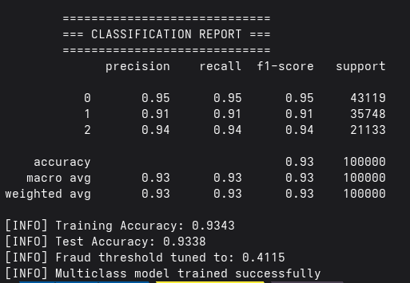
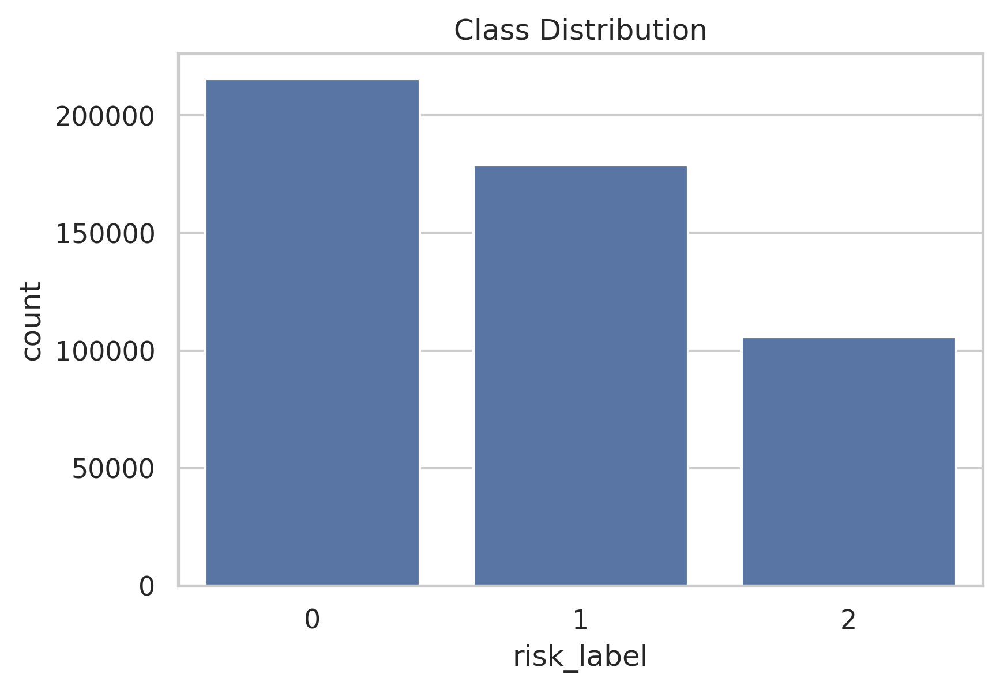
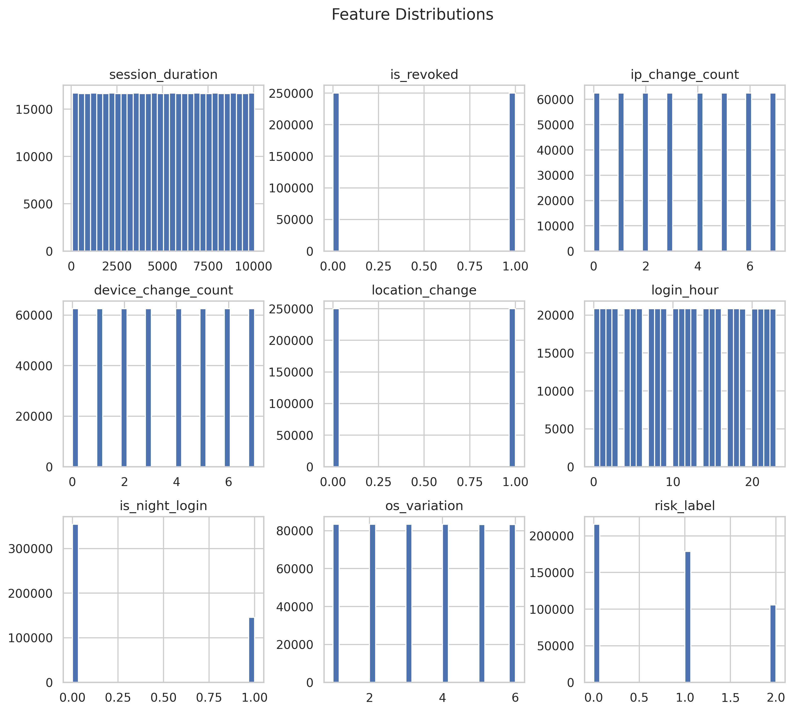
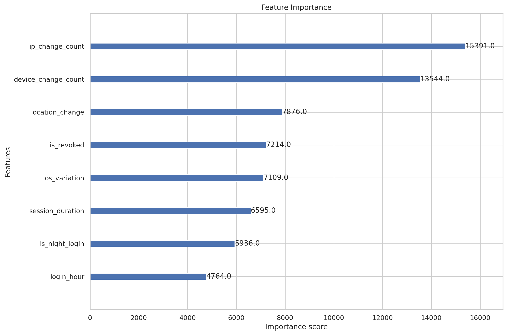
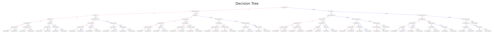

[](https://github.com/zouari-oss/user-risk-detection-api/graphs/contributors)
[](https://github.com/zouari-oss/user-risk-detection-api/network/members)
[](https://github.com/zouari-oss/user-risk-detection-api/stargazers)
[](https://github.com/zouari-oss/user-risk-detection-api/issues)
[](https://raw.githubusercontent.com/zouari-oss/user-risk-detection-api/refs/heads/main/LICENSE)
[](https://www.linkedin.com/in/zouari-omar)

<div align="center">
  <a href="https://github.com/zouari-oss/user-risk-detection-api">
    
  </a>
  <h1>user-risk-detection-api</h1>
  <h6>FastAPI-based microservice that predicts the risk level of a user session</h6>
  <br />
</div>

<p align="center">
  <a href="#overview">Overview</a> •
  <a href="#key-features">Key Features</a> •
  <a href="#risk-classes">Risk Classes</a> •
  <a href="#model-performance">Model Performance</a> •
  <a href="#dataset-generation">Dataset Generation</a> •
  <a href="#api-example">API Example</a> •
  <a href="#usage">Usage</a> •
  <a href="#download">Download</a> •
  <a href="#emailware">Emailware</a> •
  <a href="#contributing">Contributing</a> •
  <a href="#license">License</a> •
  <a href="#contact">Contact</a> •
  <a href="#acknowledgments">Acknowledgments</a>
</p>

<p align="center">
  
  
  
  
  
  
  
  
</p>

<p align="center">
    
</p>

## Overview

**user-risk-detection-api** is a FastAPI-based microservice that predicts the risk level of a user session using behavioral signals such as:

- IP changes
- device switching
- location anomalies
- login time patterns
- session duration

The model outputs a **risk classification (0 / 1 / 2)** along with probabilities.

## Key Features

- FastAPI REST API with `/docs` (Swagger UI)
- ML model powered by **XGBoost**
- Multiclass classification (safe / medium / risky)
- Probability output for each class
- Trained on large synthetic dataset (500k+ rows)
- Deterministic + noise-injected data generation
- Fraud-oriented feature engineering
- CORS enabled (frontend ready)

## Risk Classes

| Label | Meaning     |
| ----- | ----------- |
| 0     | Safe        |
| 1     | Medium Risk |
| 2     | High Risk   |




## Model Performance

- Accuracy: ~94–96%
- Balanced multiclass performance
- Robust against noisy inputs
- Tuned fraud detection threshold




## Dataset Generation

Synthetic dataset includes:

- 500,000+ unique rows
- Zero duplicates
- Controlled class balance
- Realistic noise injection

## API Example

### Endpoint

```http
POST /api/v1/predict
Content-Type: application/json
```

### Request

```json
{
  "session_duration": 180,
  "is_revoked": 0,
  "ip_change_count": 2,
  "device_change_count": 1,
  "location_change": 0,
  "login_hour": 10,
  "is_night_login": 0,
  "os_variation": 2
}
```

### Response

```json
{
  "prediction": 1,
  "confidence": 0.87,
  "probabilities": [0.1, 0.87, 0.03]
}
```

## Usage

```bash
git clone https://github.com/zouari-oss/user-risk-detection-api
cd user-risk-detection-api/project

chmod +x setup && ./setup
fastapi run
```

> [!NOTE]
> API available at: <http://localhost:8000/docs>

## Download

You can [download](https://github.com/zouari-oss/user-risk-detection-api/releases) the latest installable version of user-risk-detection-api for Windows, macOS and Linux.

## Emailware

user-risk-detection-api is an emailware. Meaning, if you liked using this app or it has helped you in any way,
would like you send as an email at <zouariomar20@gmail.com> about anything you'd want to say about
this software. I'd really appreciate it!

## Contributing

Contributions are welcome! Please feel free to submit a Pull Request.

## License

This repository is licensed under the **GPL-3.0 License**. You are free to use, modify, and distribute the content. See the [LICENSE](LICENSE) file for details.

## Contact

For questions or suggestions, feel free to reach out:

- **GitHub**: [zouari-oss](https://github.com/zouari-oss)
- **Email**: <zouariomar20@gmail.com>
- **LinkedIn**: [zouari-omar](https://www.linkedin.com/in/zouari-omar)

## Acknowledgments

Built with ❤️ for the open-source community.
